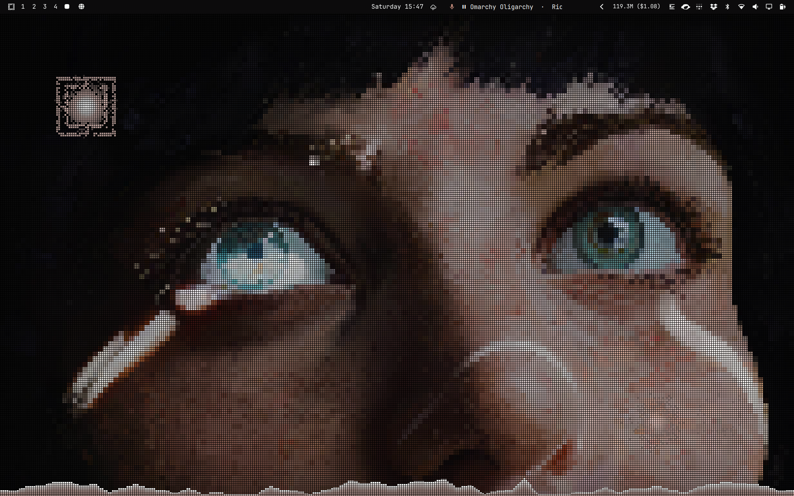
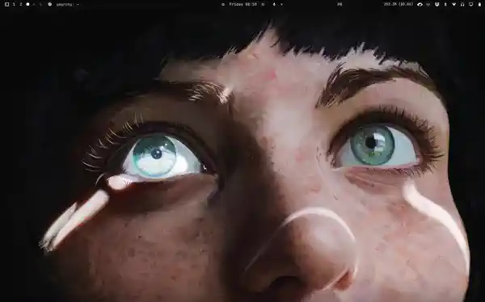

# omarchy-mozax

Dithered cursor glow with a dissolving Omarchy stamp, grid overlay, optional
wallpaper pixelation, and bar or Mosaic audio visualization for the Omarchy desktop.

The wallpaper itself remains untouched — the grid and dynamic lighting effects
draw directly on top of it. Theme switches and background cycling continue working
as normal.

## Demo



The wandering pool has just bloomed the Omarchy mark in the top left, with the
cursor pool and the audio visualizer along the bottom. Tiles light by beating
their own dither threshold, so the light arrives scattered instead of as a disc.

### Animated Demo



The wandering pool charges, blooms the mark, and melts back into scattered tiles.

## Features

- **Click Stamp with the Omarchy Mark**: Clicking the desktop stamps the Omarchy mosaic
  logo in tiles. It grows from under a cell per logo pixel to a few and dissolves through
  the same dither as the glow. Hold the press to bloom it wider.

- **Scattered Cursor Glow**: Every tile owns a threshold, and a tile only lights when the
  light under the cursor beats it. The threshold is an ordered 8x8 dither mixed with a
  per-tile random offset, the way the omarchy-site hero field does it, so the pool arrives
  as a loose constellation of squares that thickens toward the cursor and dissolves at its
  edge instead of a clean disc.

- **Audio Visualizer**: Choose spectrum bars or Mosaic tiles. Mosaic keeps
  a fixed heatmap of frequency-sensitive cells that ignite, brighten, and decay with system audio.

- **Grid Overlay**: Configurable line pitch (16px/32px default), gap width, color, and opacity.

- **Wallpaper Pixelation**: Optional retro blocky wallpaper variant.

- **Ambient Drift**: A second, fainter pool wanders the screen on two incommensurate
  periods, so it never repeats. It dims while it charges and then blooms the Omarchy
  mark, once a second or two after it starts drifting and every two to three after that —
  the site's drifting sprite, charge window and all.

## Install

```bash
omarchy plugin add https://github.com/rubichandrap/omarchy-mozax.git --enable --yes
omarchy restart shell
```

Or for local development:

```bash
cp -r ~/Projects/github.com/rubichandrap/omarchy-mozax ~/.config/omarchy/plugins/rubichandrap.mozax
omarchy restart shell
```

## Uninstall

```bash
omarchy plugin remove rubichandrap.mozax
omarchy restart shell
```

If the desktop is black after removal, re-enable Omarchy's built-in background renderer:

```bash
omarchy plugin enable omarchy.background
omarchy restart shell
```

## Requirements and Dependencies

Mozax runs inside the Omarchy shell and uses its Quickshell, Qt Quick, Wayland layer-shell,
and `qs.Ui`/`qs.Commons` modules. The audio visualizer also requires the external `cava`
package. On Arch-based Omarchy systems, install it with:

```bash
omarchy pkg add cava
```

Mozax also uses the host-provided `bash`, `readlink`, and `omarchy-theme-*` commands.
It does not bundle third-party source code or require npm, pip, or another package manager.

Mozax stores its settings in `~/.local/state/omarchy/mozax.json` and creates
`~/.local/state/omarchy/mozax-cava.conf` when the visualizer needs it. It does not overwrite
files under `~/.config/omarchy/`; changing the shell's enabled/disabled plugin list happens
only through the explicit `omarchy plugin` install, enable, or remove commands.

## License

Mozax is released under the [MIT License](LICENSE). Copyright © 2026 rubichandrap.

## Use

### Bar widget

When the plugin is enabled, a grid icon appears in the bar's right section.
Click it to open a popup with live controls for every option below — no
shell commands required. Changes apply instantly and persist across
restarts.

### Glow Controls

The tile glow is enabled by default. You can adjust its behavior dynamically via IPC:

```bash
omarchy-shell background glowToggle            # toggle glow on or off
omarchy-shell background glowStatus            # state, intensity, color, radius
omarchy-shell background glowRadius 4          # radius of the solid core, in tiles
omarchy-shell background glowIntensity 0.7     # peak brightness (0.0 - 1.0)
omarchy-shell background glowScatter 0.22      # tile randomness (0 ordered dither, 0.6 fully random)
omarchy-shell background glowDrift true        # true = ambient pool wandering, and blooming the mark
omarchy-shell background glowColor theme       # "theme" (brightened active theme accent, default) or custom hex
omarchy-shell background burst 40 20           # stamp the Omarchy mark at grid cell (col, row)
omarchy-shell background glowHover 400 300     # move the pool to a point, without a cursor
```

`glowDuration`, `glowBorder` and `glowTrail` are gone. A mark's lifetime is the site's
`(0.65 + 0.55 x charge)` seconds and no longer rides on a fade slider; a lip has no room
to sit in on a 4px tile; and the pool was never smoothed to begin with — the site lights
the cells under the cursor and only eases its response, so a trail control was a lag in
different units.

### Audio Visualizer Controls

The bottom audio visualizer is enabled by default and powered by Cava:

```bash
omarchy-shell background visualizerToggle          # toggle visualizer on or off
omarchy-shell background visualizerStatus          # state, opacity, bar height, width
omarchy-shell background visualizerVariant bars    # "bars" or "mosaic"
omarchy-shell background visualizerVariantStatus   # current visualizer variant
omarchy-shell background visualizerOpacity 0.65    # visualizer opacity (0.0 - 1.0)
omarchy-shell background visualizerMosaicRows 4    # Mosaic height in rows (1 - 12)
omarchy-shell background visualizerMosaicRowsStatus # current Mosaic row count
omarchy-shell background visualizerHeight 16       # maximum Bars height in tiles
omarchy-shell background visualizerWidth 1.0       # width ratio (1.0 / full, 0.5 / 50%, or default)
```

### Grid Overlay Controls

The grid is enabled by default with a 16px pitch and 1px black gap:

```bash
omarchy-shell background gridToggle            # grid overlay on or off
omarchy-shell background gridStatus            # state, pitch, gap, colour, opacity
omarchy-shell background gridSize 16           # line pitch in logical pixels
omarchy-shell background gridGap 1             # band width: 1 = thin lines
omarchy-shell background gridOpacity 0.5       # strength of the bands (0-1)
omarchy-shell background gridColor "#000000"   # band colour
```

### Wallpaper Pixelation Controls

Wallpaper pixelation is enabled by default:

```bash
omarchy-shell background mosaicToggle          # mosaic pixelation on or off
omarchy-shell background mosaicStatus          # "true 8" - state and block size
omarchy-shell background mosaicBlockSize 8     # block edge in logical pixels
```

## How It Works

1. **Wayland Background Layer**: The background runs on `WlrLayer.Background` with an active `MouseArea`. When the cursor moves over visible desktop wallpaper, pointer coordinates update continuously. (When application windows cover the desktop, Hyprland directs pointer events to those windows).
2. **Tile Calculation** (`PixelGlow.qml`): The cells a pool can reach are walked once per frame, and each cell gets the light it sits under:
   $$\text{light} = \left(1 - \frac{\text{dist}}{\text{reach}}\right)^{1.5}$$
   `glowRadius` is the radius of the *solid* core; the scattered halo reaches about twice as far, because the dither throws most of the light away. The site's falloff is squared, which is what puts its halo there; this one is softened so the sparse outer rings still carry a few lit tiles instead of stopping dead.
3. **Dithered Lighting**: A tile lights only when its luminance beats its own threshold, `0.78 × bayer8 + 0.22 × noise`, with the ordered part built from three interleaved 2x2 levels rather than a table, and the noise hashed from the tile's place in a 64x64 patch. Intensity moves how many tiles light; heat moves their colour along the ink ramp, dimmest to crest.
4. **Stamp Dissolve**: A press charges over 1.1s, the site's window, and releases a mark that grows from `0.45 + 1.6 x charge` cells per logo pixel toward `from + 1.0 + 3.2 x charge`, capped at 4 so the tile pool stays a size a wallpaper can afford. Amplitude falls as `(1 - age)^1.7` and it lives `(0.65 + 0.55 x charge)` seconds, so it melts away through the same threshold as the glow. Up to four overlap, and the pool recomputes from scratch each frame. The drifting sprite charges too, at no more than a quick click's worth, dimming to 40% while it does.
5. **Item Pool, Not Pixels**: The lit tiles are rectangles from a pool sized to the reach. A full-screen canvas would hand its whole backing store to the compositor every frame it changed, which costs far more than the effect is worth; a pool of items costs nothing while the cursor is still, because `needsPaint` goes false and the frame loop stops touching them.

## Notes

- Release notes are in [CHANGELOG.md](CHANGELOG.md).
- Fork of the built-in `omarchy.background` renderer (declared through `omarchy.clonedFrom`). It replaces the default background renderer while enabled.
- State is persisted to `~/.local/state/omarchy/mozax.json` on every change: IPC-tuned knobs survive a shell restart. Delete that file to fall back to the defaults in `Background.qml`.
- Uninstall with `omarchy plugin remove rubichandrap.mozax` to restore the default background.
- Desktop goes black after disabling Mozax? See Troubleshooting below.

## Troubleshooting

### Black desktop after disabling Mozax

Mozax replaces the built-in renderer through `omarchy.clonedFrom`, so enabling it
switches `omarchy.background` off. The shell restores that built-in only when it
recorded the switch itself, in `cloneSourceRestores` inside
`~/.config/omarchy/shell.json`. If `omarchy.background` was already listed in
`disabledPlugins` when Mozax was enabled, nothing records the restore intent, and
disabling Mozax leaves the desktop with no background renderer at all — a black
desktop, not a broken wallpaper or theme.

Check the state and put the built-in renderer back:

```bash
jq '.plugins, .disabledPlugins, .cloneSourceRestores' ~/.config/omarchy/shell.json
omarchy plugin enable omarchy.background
hyprctl layers | grep omarchy-background   # layer is drawn again
```
