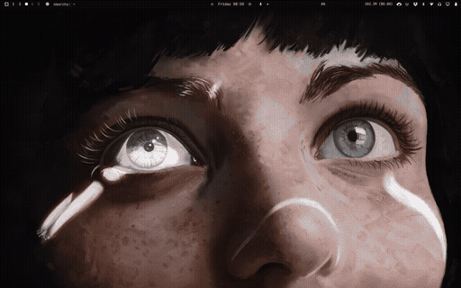

# omarchy-mozax

Grid overlay, interactive cursor-hover tile glow, optional wallpaper pixelation,
and bar or Mosaic audio visualization for the Omarchy desktop.

The wallpaper itself remains untouched — the grid and dynamic lighting effects
draw directly on top of it. Theme switches and background cycling continue working
as normal.

## Demo



The recording covers the interactive glow, click burst, audio visualizer, grid overlay,
wallpaper pixelation, and bar controls in one place.

## Features

- **Click Burst with Animated Omarchy Logo**: Clicking on the desktop triggers an expanding
  wave of glowing Omarchy mosaic tiles that scale up radially from the cursor, respecting your glow radius and theme accent.

- **Cursor-Hover Tile Glow**: As the cursor moves across the desktop, tiles light up
  and shine brighter based on their underlying wallpaper colors with smooth radial falloff.

- **Audio Visualizer**: Choose spectrum bars or Mosaic tiles. Mosaic keeps
  a fixed heatmap of frequency-sensitive cells that ignite, brighten, and decay with system audio.

- **Grid Overlay**: Configurable line pitch (16px/32px default), gap width, color, and opacity.

- **Wallpaper Pixelation**: Optional retro blocky wallpaper variant.

- **Glowing Trail**: Leaves a smooth, fading wake behind the cursor (configurable duration
  or instant follow).

## Install

```bash
omarchy plugin add https://github.com/rubichandrap/omarchy-mozax.git --enable --yes
omarchy restart shell
```

Or for local development:

```bash
cp -r ~/Projects/github.com/rubichandrap/omarchy-mozax ~/.config/omarchy/plugins/rubichandrap.mozax
omarchy restart shell
```

## Use

### Bar widget

When the plugin is enabled, a grid icon appears in the bar's right section.
Click it to open a popup with live controls for every option below — no
shell commands required. Changes apply instantly and persist across
restarts.

### Glow Controls

The tile glow is enabled by default. You can adjust its behavior dynamically via IPC:

```bash
omarchy-shell background glowToggle            # toggle glow on or off
omarchy-shell background glowStatus            # state, intensity, duration, trail, color, radius, mode
omarchy-shell background glowRadius 3          # spotlight radius in tiles (0 = single tile)
omarchy-shell background glowIntensity 0.45    # peak center brightness (0.0 - 1.0)
omarchy-shell background glowDuration 400      # fade-out trail duration in ms (0 = instant)
omarchy-shell background glowTrail true        # true = smooth fading trail, false = instant follow
omarchy-shell background glowColor theme       # "theme" (brightened active theme accent, default) or custom hex
omarchy-shell background glowBorder true       # subtle illuminated tile border (true/false)
```

### Audio Visualizer Controls

The bottom audio visualizer is enabled by default and powered by Cava:

```bash
omarchy-shell background visualizerToggle          # toggle visualizer on or off
omarchy-shell background visualizerStatus          # state, opacity, bar height, width
omarchy-shell background visualizerVariant bars    # "bars" or "mosaic"
omarchy-shell background visualizerVariantStatus   # current visualizer variant
omarchy-shell background visualizerOpacity 0.65    # visualizer opacity (0.0 - 1.0)
omarchy-shell background visualizerMosaicRows 4    # Mosaic height in rows (1 - 12)
omarchy-shell background visualizerMosaicRowsStatus # current Mosaic row count
omarchy-shell background visualizerHeight 16       # maximum Bars height in tiles
omarchy-shell background visualizerWidth 1.0       # width ratio (1.0 / full, 0.5 / 50%, or default)
```

### Grid Overlay Controls

The grid is enabled by default with a 16px pitch and 1px black gap:

```bash
omarchy-shell background gridToggle            # grid overlay on or off
omarchy-shell background gridStatus            # state, pitch, gap, colour, opacity
omarchy-shell background gridSize 16           # line pitch in logical pixels
omarchy-shell background gridGap 1             # band width: 1 = thin lines
omarchy-shell background gridOpacity 0.5       # strength of the bands (0-1)
omarchy-shell background gridColor "#000000"   # band colour
```

### Wallpaper Pixelation Controls

Wallpaper pixelation is enabled by default:

```bash
omarchy-shell background mosaicToggle          # mosaic pixelation on or off
omarchy-shell background mosaicStatus          # "true 8" - state and block size
omarchy-shell background mosaicBlockSize 8     # block edge in logical pixels
```

## How It Works

1. **Wayland Background Layer**: The background runs on `WlrLayer.Background` with an active `MouseArea`. When the cursor moves over visible desktop wallpaper, pointer coordinates update continuously. (When application windows cover the desktop, Hyprland directs pointer events to those windows).
2. **Tile Calculation**: Coordinates snap mathematically to grid cells around the cursor within `glowRadius`.
3. **Radial Distance Falloff**: Tiles within the radius illuminate with cosine distance falloff:
   $$\text{falloff} = \cos\left(\frac{\text{dist}}{\text{maxDist}} \times \frac{\pi}{2}\right)$$
   The tile directly under the cursor is brightest, tapering down smoothly to the outer perimeter.
4. **Radius-Aware Decay Pool**: The pool reserves one full lit footprint for the fading wake (up to 698 delegates at radius 10), while effective trail duration scales from 1× to 2.5× as radius increases. A boundary-only FIFO retires the oldest trail cells first, preserving a rounded outer cap without reordering the full footprint on every move.

## Notes

- Fork of the built-in `omarchy.background` renderer (declared through `omarchy.clonedFrom`). It replaces the default background renderer while enabled.
- State is persisted to `~/.local/state/omarchy/mozax.json` on every change: IPC-tuned knobs survive a shell restart. Delete that file to fall back to the defaults in `Background.qml`.
- Uninstall with `omarchy plugin remove rubichandrap.mozax` to restore the default background.
- Desktop goes black after disabling Mozax? See Troubleshooting below.

## Troubleshooting

### Black desktop after disabling Mozax

Mozax replaces the built-in renderer through `omarchy.clonedFrom`, so enabling it
switches `omarchy.background` off. The shell restores that built-in only when it
recorded the switch itself, in `cloneSourceRestores` inside
`~/.config/omarchy/shell.json`. If `omarchy.background` was already listed in
`disabledPlugins` when Mozax was enabled, nothing records the restore intent, and
disabling Mozax leaves the desktop with no background renderer at all — a black
desktop, not a broken wallpaper or theme.

Check the state and put the built-in renderer back:

```bash
jq '.plugins, .disabledPlugins, .cloneSourceRestores' ~/.config/omarchy/shell.json
omarchy plugin enable omarchy.background
hyprctl layers | grep omarchy-background   # layer is drawn again
```
